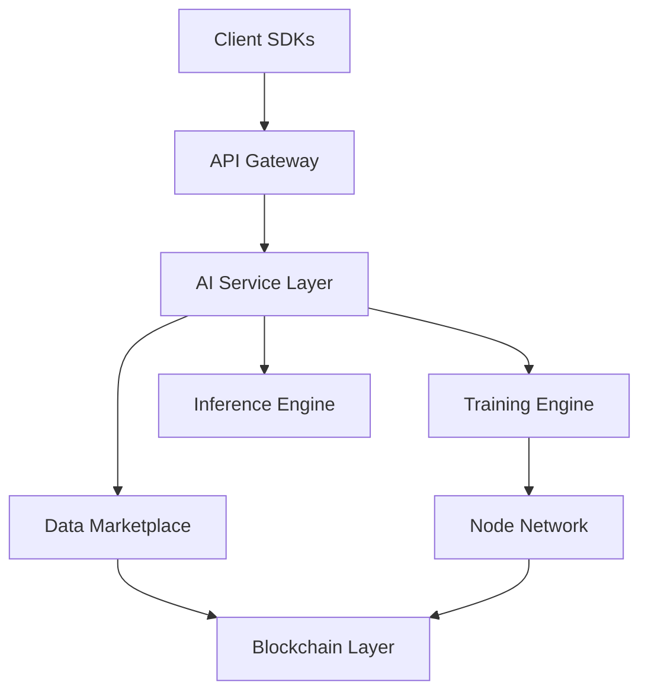

# AIPlatform 🚀

> **Next-Generation Decentralized AI Platform** — built by [REChain Network Solutions](https://github.com/REChain-Network-Solutions) to enable scalable, secure, and collaborative AI systems for everyone.

---

## 🌐 Overview

AIPlatform is a **modular, decentralized AI ecosystem** designed for researchers, developers, and enterprises. It combines **AI frameworks, blockchain-powered governance, data marketplaces, and privacy-preserving computation** into one platform.

---

## ✨ Key Features

- ⚡ **Decentralized Training** — run distributed AI workloads across nodes.
- 🔐 **Privacy-First** — supports homomorphic encryption, ZKP, and MPC.
- 🌍 **Data Marketplace** — buy/sell datasets with full ownership rights.
- 🤖 **Model Hub** — share, discover, and deploy AI models collaboratively.
- 🔗 **Blockchain Integration** — ensures transparency, tokenomics, and governance.
- 📦 **Modular SDK** — extend functionality with custom plugins and APIs.

---

## 🏗️ Architecture



---

## 📂 Repository Structure

```
AIPlatform/
├── docs/               # Documentation & diagrams
├── sdk/                # Client SDKs (Python, JS, Dart)
├── core/               # Core AI services
├── blockchain/         # Smart contracts & governance
├── marketplace/        # Data & model marketplace
├── scripts/            # Deployment scripts
└── tests/              # Automated tests
```

---

## ⚙️ Installation

```bash
# Clone the repository
git clone https://github.com/REChain-Network-Solutions/AIPlatform.git
cd AIPlatform

# Install dependencies
pip install -r requirements.txt

# Setup environment
cp .env.example .env
```

---

## 🚀 Usage

### Start Local Node
```bash
python core/node.py
```

### Run Distributed Training
```bash
python core/train.py --dataset data/sample.csv --model resnet
```

### Deploy Smart Contracts
```bash
cd blockchain
truffle migrate --network testnet
```

---

## 📖 Documentation

- [Wiki](https://github.com/REChain-Network-Solutions/AIPlatform/wiki)
- [API Reference](docs/api.md)
- [Architecture Guide](docs/architecture.md)

---

## 🛡 Security

We follow **security by design**:
- End-to-end encryption
- Privacy-preserving computation
- Decentralized identity (DID)
- Tokenized governance

---

## 🤝 Contributing

We welcome contributions from the community!

1. Fork the repo
2. Create a new branch (`feature/my-feature`)
3. Commit your changes
4. Push the branch
5. Submit a Pull Request 🚀

---

## 🗺 Roadmap

- [ ] AI-powered Federated Learning
- [ ] Full Data DAO Governance
- [ ] Support for Web5/Decentralized Identity
- [ ] Mobile SDK (Flutter/Dart)

---

## 📜 License

This project is licensed under the **MIT License**.

---

## 🌟 Credits

Built with ❤️ by **REChain Network Solutions**
