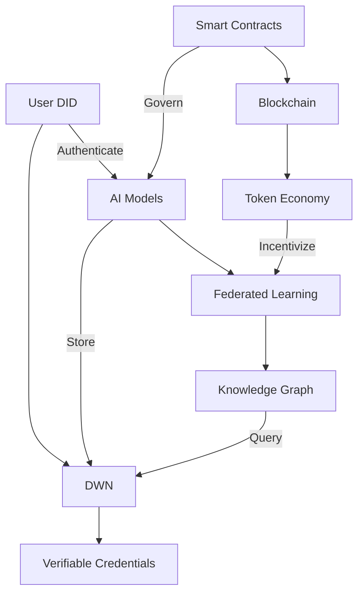

# AIPlatform 🚀

> **Next-Generation Decentralized AI Platform** — built on Web3, Web4, and Web5 technologies to enable scalable, secure, and collaborative AI systems for everyone.

[](https://opensource.org/licenses/MIT)
[](https://developer.tbd.website/)
[](https://ethereum.org/en/web3/)
[](https://nodejs.org/)
[](https://www.python.org/)
[](https://soliditylang.org/)

## 🌐 Overview

AIPlatform is a **modular, decentralized AI ecosystem** built on Web3, Web4, and Web5 technologies. It combines **AI frameworks, blockchain-powered governance, data marketplaces, and privacy-preserving computation** into one unified platform.

### Core Technologies

| Layer | Technology | Purpose |
|-------|------------|---------|
| **Web5** | DIDs, DWN, VCs | Decentralized identity and data |
| **Web4** | AI/ML, Federated Learning | Intelligent applications |
| **Web3** | Blockchain, Smart Contracts | Trustless transactions and governance |

## ✨ Key Features

### Web5 Layer
- 🆔 **Self-Sovereign Identity** — Decentralized Identifiers (DIDs) for users and devices
- 🔒 **Encrypted Data Vaults** — Secure, user-controlled data storage
- 📜 **Verifiable Credentials** — Trustless verification of claims and attestations

### Web4 Layer
- 🧠 **Federated Learning** — Train AI models without sharing raw data
- 🤖 **AI Model Marketplace** — Buy, sell, and trade AI models
- 🔍 **Semantic Search** — Advanced search across decentralized data

### Web3 Layer
- 💰 **Token Economy** — Native token for platform governance and payments
- 🏛️ **DAOs** — Community-driven decision making
- 🔗 **Cross-Chain** — Interoperability with multiple blockchains

## 🚀 Quick Start

### Prerequisites

- Node.js 20.x
- Python 3.8+
- Git
- Docker (optional)
- Web5 Wallet (e.g., TBDex, Web5.js)
- MetaMask or other Web3 wallet

### Installation

1. **Clone the repository**
   ```bash
   git clone https://github.com/REChain-Network-Solutions/AIPlatform.git
   cd AIPlatform
   ```

2. **Install dependencies**
   ```bash
   # Install JavaScript dependencies
   npm install
   
   # Install Python dependencies
   pip install -r requirements.txt
   ```

3. **Set up environment**
   ```bash
   cp .env.example .env
   # Edit .env with your configuration
   ```

4. **Start development servers**
   ```bash
   # Start local blockchain
   npx hardhat node
   
   # In a new terminal, deploy contracts
   npx hardhat run scripts/deploy.js --network localhost
   
   # Start frontend development server
   npm run dev
   ```

5. **Access the application**
   Open your browser and navigate to `http://localhost:3000`

## 📚 Documentation

Comprehensive documentation is available in the [docs](./docs) directory:

- [Architecture Overview](./docs/architecture/overview.md)
- [Web3 Integration](./docs/architecture/web3/README.md)
- [Web4 AI/ML Layer](./docs/architecture/web4/README.md)
- [Web5 Identity & Data](./docs/architecture/web5/README.md)
- [Integration Guide](./docs/integration/README.md)
- [Getting Started Guide](./docs/guides/getting-started.md)

## 🏗️ Architecture



### Data Flow
1. **Identity & Auth**: Users authenticate with Web5 DIDs
2. **Data Storage**: Encrypted data stored in DWN
3. **AI Processing**: Federated learning on user data
4. **Governance**: On-chain voting for model updates
5. **Monetization**: Token rewards for data contributions

## 📂 Project Structure

```
AIPlatform/
├── contracts/          # Smart contracts (Solidity)
│   ├── governance/     # DAO and voting
│   ├── tokens/         # ERC-20/721 tokens
│   └── marketplace/    # Data/Model marketplace
├── dwn/                # Decentralized Web Nodes
│   ├── schemas/        # Data schemas
│   └── protocols/      # Custom DWN protocols
├── frontend/           # Web interface
│   ├── public/         # Static assets
│   └── src/            # React/Vue components
│       ├── components/ # Reusable UI components
│       ├── hooks/      # Custom React hooks
│       └── web5/       # Web5 integration
├── ai/                 # AI/ML components
│   ├── models/         # Model architectures
│   ├── training/       # Training scripts
│   └── inference/      # Model serving
├── docs/               # Documentation
└── tests/              # Test suites
    ├── contracts/      # Smart contract tests
    ├── dwn/            # DWN protocol tests
    └── ai/             # Model validation tests
```

## 🔧 Development

### Running Tests

```bash
# Run smart contract tests
npx hardhat test

# Run AI model tests
pytest ai/tests/

# Run frontend tests
npm test
```

### Building for Production

```bash
# Compile smart contracts
npx hardhat compile

# Deploy contracts
npx hardhat run scripts/deploy.js --network mainnet

# Build frontend
npm run build

# Package AI models
python scripts/package_models.py
```

### Local Development

Start a local development environment with Docker:

```bash
docker-compose up -d
```

This will start:
- Local blockchain node (Hardhat)
- IPFS node
- The Graph node (for indexing)
- Web5 DWN node

## 📚 Documentation

Explore our comprehensive documentation to get started:

### Core Concepts
- [Web3/4/5 Architecture](./docs/architecture/overview.md)
- [Decentralized Identity](./docs/architecture/web5/README.md)
- [AI/ML Integration](./docs/architecture/web4/README.md)
- [Blockchain Layer](./docs/architecture/web3/README.md)

### Guides
- [Getting Started](./docs/guides/getting-started.md)
- [Building Your First DApp](./docs/guides/building-dapp.md)
- [AI Model Training](./docs/guides/ai-training.md)
- [Smart Contract Development](./docs/guides/smart-contracts.md)

### API Reference
- [Web5 SDK](./docs/api/web5-sdk.md)
- [Smart Contracts](./docs/api/smart-contracts.md)
- [REST API](./docs/api/rest-api.md)

## 🛡 Security

Security is fundamental to our platform. We implement multiple layers of protection:

### Security Features
- End-to-end encryption for all data
- Zero-knowledge proofs for privacy
- Multi-signature wallets for treasury
- Regular security audits

### Reporting Vulnerabilities
Please report security issues to security@rechain.network. We operate a bug bounty program for responsible disclosures.

### Audits
- [CertiK Audit Report](./audits/certik-audit-2023.pdf)
- [OpenZeppelin Audit Report](./audits/openzeppelin-audit-2023.pdf)

## 🤝 Contributing

We welcome contributions from the community! Here's how you can help:

1. **Code Contributions**: Submit pull requests for new features or bug fixes
2. **Documentation**: Help improve our docs or translate them
3. **Testing**: Report bugs or help test new features
4. **Community**: Help others in our [Discord](https://discord.gg/aiplatform)

Please read our [Contributing Guide](CONTRIBUTING.md) for details.

## 🌍 Community

- [Discord](https://discord.gg/aiplatform) - Chat with the community
- [Twitter](https://twitter.com/aiplatform) - Latest updates
- [GitHub Discussions](https://github.com/REChain-Network-Solutions/AIPlatform/discussions) - Q&A
- [Blog](https://blog.aiplatform.org) - Tutorials and articles

## 📄 License

This project is licensed under the MIT License - see the [LICENSE](LICENSE) file for details.

## 🙏 Acknowledgments

- [Web5](https://developer.tbd.website/) - Decentralized identity and data
- [Ethereum](https://ethereum.org/) - Smart contract platform
- [IPFS](https://ipfs.tech/) - Decentralized storage
- [TensorFlow](https://www.tensorflow.org/) - Machine learning
- [All Contributors](https://github.com/REChain-Network-Solutions/AIPlatform/graphs/contributors)

---

<div align="center">
  <p>🌐 Built with ❤️ by <a href="https://rechain.network">REChain Network Solutions</a></p>
  <p>🚀 Empowering the decentralized AI revolution</p>
  <p>© 2025 REChain Network Solutions. All rights reserved.</p>
</div>

We follow **security by design**:
- End-to-end encryption
- Privacy-preserving computation
- Decentralized identity (DID)
- Tokenized governance

---

## 🤝 Contributing

We welcome contributions from the community!

1. Fork the repo
2. Create a new branch (`feature/my-feature`)
3. Commit your changes
4. Push the branch
5. Submit a Pull Request 🚀

---

## 🗺 Roadmap

- [ ] AI-powered Federated Learning
- [ ] Full Data DAO Governance
- [ ] Support for Web5/Decentralized Identity
- [ ] Mobile SDK (Flutter/Dart)

---

## 📜 License

This project is licensed under the **MIT License**.

---

## 🌟 Credits

Built with ❤️ by **REChain Network Solutions**
