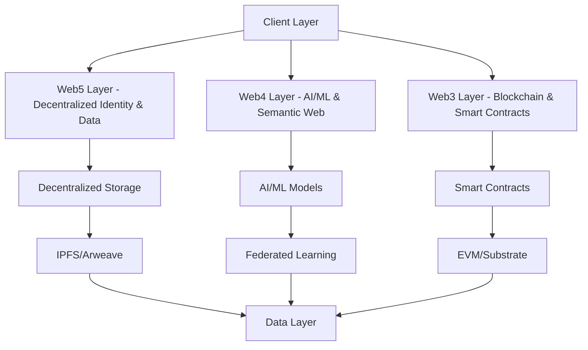

# AIPlatform Web3/4/5 Architecture

## Overview

This document outlines the multi-layered architecture of AIPlatform, integrating Web3, Web4, and Web5 technologies to create a decentralized, scalable, and user-centric AI platform.

## Architecture Layers

## Component Breakdown

### 1. Web3 Layer (Blockchain Infrastructure)
- **Smart Contracts**: For decentralized governance, tokenomics, and protocol rules
- **Blockchain Network**: EVM-compatible chain or Substrate-based
- **Wallets & Signers**: Integration with popular Web3 wallets
- **Oracles**: For off-chain data verification

### 2. Web4 Layer (AI/ML & Semantic Web)
- **Federated Learning**: Decentralized model training
- **Knowledge Graphs**: For semantic understanding
- **AI Agents**: Autonomous agents for platform operations
- **Data Marketplaces**: For training data exchange

### 3. Web5 Layer (Decentralized Identity & Data)
- **DID (Decentralized Identifiers)**: Self-sovereign identity
- **VC (Verifiable Credentials)**: For reputation and credentials
- **DWN (Decentralized Web Nodes)**: Personal data storage
- **DAGs**: For data structure and verification

## Data Flow

1. **User Authentication**: Web5 DIDs for identity
2. **Data Storage**: Encrypted storage via IPFS/Arweave
3. **Computation**: Federated learning for AI/ML
4. **Governance**: On-chain voting and proposals
5. **Monetization**: Token-based economy

## Security Considerations
- End-to-end encryption
- Zero-knowledge proofs for privacy
- Multi-signature wallets
- Decentralized access control
