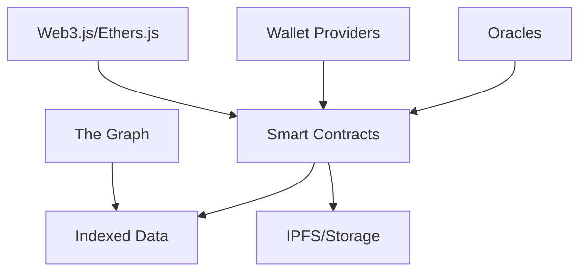

# Web3 Architecture

## Overview
The Web3 layer provides the blockchain infrastructure for AIPlatform, enabling decentralized governance, tokenomics, and trustless interactions.

## Core Components

### 1. Smart Contracts
- **Governance**: DAO for platform decisions
- **Token Economy**: Native token for transactions and staking
- **Marketplace**: For AI models and data trading
- **Reputation System**: For participants' credibility

### 2. Blockchain Network
- **Base Layer**: EVM-compatible (Ethereum, Polygon, etc.)
- **Sidechains/Subnets**: For scalability
- **Bridges**: For cross-chain interoperability

### 3. Wallet Integration
- **Browser Wallets**: MetaMask, WalletConnect
- **Hardware Wallet** support
- **Multi-sig** for organizational accounts

## Technical Stack



## Implementation Guide

### 1. Setting Up Development Environment
```bash
# Install Hardhat
npm install --save-dev hardhat

# Initialize project
npx hardhat

# Install dependencies
npm install @openzeppelin/contracts @nomiclabs/hardhat-ethers ethers
```

### 2. Example Smart Contract
```solidity
// SPDX-License-Identifier: MIT
pragma solidity ^0.8.20;

import "@openzeppelin/contracts/token/ERC20/ERC20.sol";

contract AIToken is ERC20 {
    constructor() ERC20("AIToken", "AIT") {
        _mint(msg.sender, 1000000 * 10 ** decimals());
    }
}
```

### 3. Integration Points
1. **Frontend**: Web3Modal for wallet connection
2. **Backend**: Web3 providers (Alchemy, Infura)
3. **Indexing**: The Graph for querying blockchain data

## Security Best Practices
- Use OpenZeppelin contracts
- Implement reentrancy guards
- Use Chainlink for price feeds
- Regular security audits
