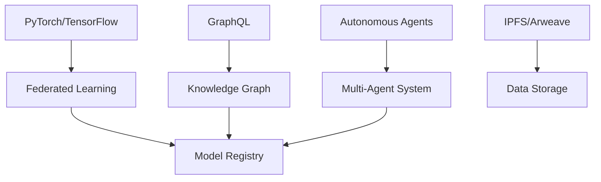

# Web4 Architecture

## Overview
The Web4 layer focuses on AI/ML capabilities and semantic web technologies to create intelligent, context-aware applications.

## Core Components

### 1. Federated Learning
- Decentralized model training
- Privacy-preserving machine learning
- Incentivized participation

### 2. Knowledge Graphs
- Semantic understanding of data
- RDF/SPARQL for querying
- Ontology management

### 3. AI Agents
- Autonomous agents for platform operations
- Multi-agent systems
- Agent communication protocols

### 4. Data Marketplaces
- Decentralized data exchange
- Data quality verification
- Fair pricing models

## Technical Stack



## Implementation Guide

### 1. Federated Learning Setup
```python
import torch
import torch.nn as nn
import torch.optim as optim
from torch.utils.data import DataLoader, Dataset

class SimpleModel(nn.Module):
    def __init__(self):
        super(SimpleModel, self).__init__()
        self.layer = nn.Linear(10, 2)
    
    def forward(self, x):
        return self.layer(x)

def train_model(model, dataloader, epochs=5):
    criterion = nn.CrossEntropyLoss()
    optimizer = optim.SGD(model.parameters(), lr=0.01)
    
    for epoch in range(epochs):
        for inputs, labels in dataloader:
            optimizer.zero_grad()
            outputs = model(inputs)
            loss = criterion(outputs, labels)
            loss.backward()
            optimizer.step()
    
    return model.state_dict()
```

### 2. Knowledge Graph Integration
```python
from rdflib import Graph, Literal, Namespace
from rdflib.namespace import RDF, RDFS, XSD

# Create a new graph
g = Graph()

# Define namespace
n = Namespace("http://example.org/aiplatform/")

# Add triples
g.add((n.Model1, RDF.type, n.AIModel))
g.add((n.Model1, n.hasAccuracy, Literal(0.95, datatype=XSD.float)))

# Serialize to TTL
g.serialize(destination='knowledge_graph.ttl', format='turtle')
```

### 3. Data Marketplace Smart Contract
```solidity
// SPDX-License-Identifier: MIT
pragma solidity ^0.8.20;

contract DataMarketplace {
    struct Dataset {
        address owner;
        string ipfsHash;
        uint256 price;
        bool isAvailable;
    }
    
    mapping(uint256 => Dataset) public datasets;
    uint256 public datasetCount;
    
    event DatasetListed(uint256 id, address owner, string ipfsHash, uint256 price);
    event DatasetPurchased(uint256 id, address buyer, uint256 price);
    
    function listDataset(string memory _ipfsHash, uint256 _price) public {
        datasetCount++;
        datasets[datasetCount] = Dataset({
            owner: msg.sender,
            ipfsHash: _ipfsHash,
            price: _price,
            isAvailable: true
        });
        
        emit DatasetListed(datasetCount, msg.sender, _ipfsHash, _price);
    }
    
    function purchaseDataset(uint256 _id) public payable {
        Dataset storage dataset = datasets[_id];
        require(dataset.isAvailable, "Dataset not available");
        require(msg.value >= dataset.price, "Insufficient payment");
        
        // Transfer payment to dataset owner (minus platform fee)
        uint256 platformFee = (msg.value * 5) / 100; // 5% platform fee
        uint256 ownerPayment = msg.value - platformFee;
        
        payable(dataset.owner).transfer(ownerPayment);
        
        // Mark as sold
        dataset.isAvailable = false;
        
        emit DatasetPurchased(_id, msg.sender, msg.value);
    }
}
```

## Integration Points

1. **Frontend**: React/Vue.js with Web3 integration
2. **Backend**: Node.js with Express/NestJS
3. **AI/ML**: Python with PyTorch/TensorFlow
4. **Blockchain**: Smart contracts for marketplace and governance
5. **Storage**: IPFS/Arweave for decentralized storage

## Best Practices

1. **Privacy-Preserving AI**:
   - Use federated learning for model training
   - Implement differential privacy
   - Use homomorphic encryption for sensitive data

2. **Scalability**:
   - Use sharding for knowledge graphs
   - Implement caching for frequently accessed data
   - Use CDN for static assets

3. **Interoperability**:
   - Follow W3C standards for semantic web
   - Use JSON-LD for structured data
   - Implement GraphQL for flexible queries
