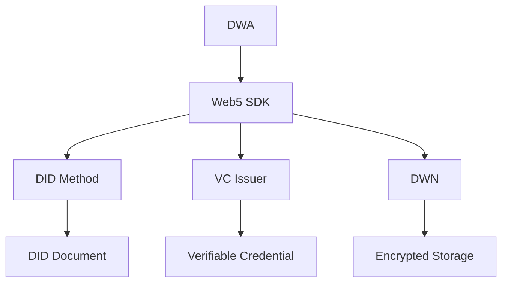

# Web5 Architecture

## Overview
The Web5 layer provides decentralized identity and data storage capabilities, enabling users to own and control their data across applications.

## Core Components

### 1. Decentralized Identifiers (DIDs)
- Self-sovereign identity
- DID methods (key, web, ion)
- DID resolution

### 2. Verifiable Credentials
- W3C VC standard
- Selective disclosure
- Zero-knowledge proofs

### 3. Decentralized Web Nodes (DWN)
- Personal data storage
- Encrypted data vaults
- Permissioned access

### 4. Decentralized Web Apps (DWAs)
- Client-side applications
- No centralized backend required
- Peer-to-peer communication

## Technical Stack



## Implementation Guide

### 1. Setting Up Web5
```bash
# Install Web5 packages
npm install @web5/api @web5/credentials @tbd54566975/web5-user-agent
```

### 2. Creating a DID
```javascript
import { Web5 } from '@web5/api';

// Initialize Web5
const { web5, did: userDid } = await Web5.connect({
  sync: '5s',
  techPreview: {
    dwnEndpoints: ['https://dwn.tbddev.org/dwn0']
  }
});

console.log('User DID:', userDid);
```

### 3. Creating a Verifiable Credential
```javascript
import { VerifiableCredential, PresentationExchange } from '@web5/credentials';

// Create VC
const vc = await VerifiableCredential.create({
  type: 'EmailVerification',
  issuer: 'did:example:issuer',
  subject: 'did:example:user123',
  data: {
    email: 'user@example.com',
    isVerified: true
  },
  expirationDate: '2025-12-31T23:59:59Z'
});

// Sign VC
const signedVc = await vc.sign({ did: 'did:example:issuer#key-1' });
```

### 4. Decentralized Web Node (DWN) Integration
```javascript
// Create a record
const { record } = await web5.dwn.records.create({
  data: 'Hello, Web5!',
  message: {
    dataFormat: 'text/plain',
  },
});

// Read records
const { records } = await web5.dwn.records.query({
  message: {
    filter: {
      dataFormat: 'text/plain',
    },
  },
});
```

## Integration Points

1. **Authentication**:
   ```javascript
   // Request authentication
   const { did } = await web5.did.request();
   ```

2. **Data Storage**:
   ```javascript
   // Store encrypted data
   await web5.dwn.records.create({
     data: encryptedData,
     message: {
       dataFormat: 'application/json',
       schema: 'https://schema.org/Person',
     },
   });
   ```

3. **Data Sharing**:
   ```javascript
   // Grant read access
   await web5.dwn.permissions.grant({
     target: 'did:example:friend',
     scope: 'read',
     objectId: recordId,
   });
   ```

## Security Considerations

1. **Key Management**:
   - Use hardware security modules (HSM)
   - Implement key rotation
   - Backup and recovery procedures

2. **Data Privacy**:
   - End-to-end encryption
   - Zero-knowledge proofs
   - Selective disclosure

3. **Access Control**:
   - Fine-grained permissions
   - Time-based access
   - Revocation mechanisms

## Example: Decentralized AI Model Training

```javascript
// 1. User grants access to training data
const trainingData = await web5.dwn.records.query({
  message: {
    filter: {
      schema: 'https://schema.org/Dataset',
      tags: ['training']
    }
  }
});

// 2. AI service requests access
const response = await web5.dwn.permissions.request({
  target: 'did:example:ai-service',
  scope: 'read',
  objectId: trainingData.records[0].id,
  description: 'Access to training data for model improvement'
});

// 3. After training, store the model
const model = {
  name: 'Sentiment Analysis v1',
  accuracy: 0.92,
  framework: 'tensorflow',
  weights: 'ipfs://bafy...',
};

await web5.dwn.records.create({
  data: model,
  message: {
    dataFormat: 'application/json',
    schema: 'https://schema.org/AIModel',
  },
});
```

## Best Practices

1. **User Experience**:
   - Progressive enhancement
   - Offline-first design
   - Clear consent flows

2. **Performance**:
   - Lazy loading of DWN data
   - Caching strategies
   - Batch operations

3. **Interoperability**:
   - Follow W3C standards
   - Support multiple DID methods
   - Use common data schemas
