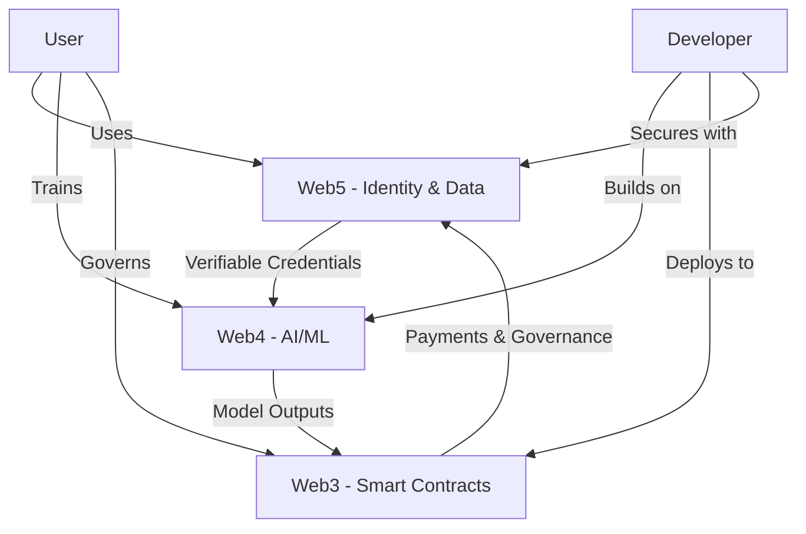

# Web3/4/5 Integration Guide

This document explains how to integrate Web3, Web4, and Web5 technologies in the AIPlatform.

## Architecture Overview



## Integration Points

### 1. User Onboarding Flow

1. **Web5**: User creates a DID
2. **Web3**: User receives platform tokens
3. **Web4**: User sets up AI preferences

```javascript
// Example onboarding flow
async function onboardUser() {
  // 1. Create Web5 DID
  const { web5, did } = await Web5.connect();
  
  // 2. Mint platform tokens (Web3)
  const tx = await tokenContract.mint(did, '1000');
  await tx.wait();
  
  // 3. Set up AI preferences (Web4)
  await web5.dwn.records.create({
    data: {
      preferences: {
        language: 'en',
        modelSize: 'medium',
        privacyLevel: 'high'
      }
    },
    message: {
      dataFormat: 'application/json',
      schema: 'https://schema.org/UserPreferences'
    }
  });
}
```

### 2. AI Model Training

1. **Web4**: Train model with federated learning
2. **Web5**: Store model with user-controlled access
3. **Web3**: Reward participants with tokens

```solidity
// Smart Contract for AI Training Rewards
contract AIRewards {
    mapping(address => uint256) public rewards;
    address public modelOwner;
    
    event RewardDistributed(address indexed participant, uint256 amount);
    
    constructor() {
        modelOwner = msg.sender;
    }
    
    function distributeRewards(
        address[] calldata participants,
        uint256[] calldata amounts
    ) external {
        require(msg.sender == modelOwner, "Not authorized");
        require(participants.length == amounts.length, "Invalid input");
        
        for (uint i = 0; i < participants.length; i++) {
            rewards[participants[i]] += amounts[i];
            emit RewardDistributed(participants[i], amounts[i]);
        }
    }
}
```

### 3. Data Marketplace

1. **Web5**: Users own and control their data
2. **Web3**: Smart contracts handle transactions
3. **Web4**: AI models consume the data

```javascript
// Example data listing
async function listDataset(web5, dataset, price) {
  // 1. Store data in DWN
  const { record } = await web5.dwn.records.create({
    data: dataset,
    message: {
      dataFormat: 'application/json',
      schema: 'https://schema.org/Dataset',
    },
  });
  
  // 2. Create listing on blockchain
  const tx = await marketplaceContract.listDataset(
    record.id,
    web5.did,
    price
  );
  
  return tx.hash;
}
```

## Implementation Roadmap

### Phase 1: Foundation (Q1 2024)
- [ ] Implement Web5 DID and basic DWN
- [ ] Deploy core smart contracts
- [ ] Set up federated learning infrastructure

### Phase 2: Integration (Q2 2024)
- [ ] Connect DWN with smart contracts
- [ ] Implement token incentives
- [ ] Develop basic AI models

### Phase 3: Scaling (Q3 2024)
- [ ] Optimize for performance
- [ ] Add more AI capabilities
- [ ] Improve user experience

## Security Considerations

1. **Data Privacy**:
   - End-to-end encryption
   - Zero-knowledge proofs
   - Selective disclosure

2. **Smart Contract Security**:
   - Formal verification
   - Audits
   - Bug bounties

3. **Access Control**:
   - Fine-grained permissions
   - Time-based access
   - Revocation mechanisms

## Example: Decentralized AI Assistant

```javascript
// Web5: User identity and data
const { web5, did } = await Web5.connect();

// Web4: Load AI model
const model = await loadAIModel('gpt-4');

// Web3: Check token balance
const balance = await tokenContract.balanceOf(did);

// Process user query
async function processQuery(query) {
  // 1. Get user context from DWN
  const { records } = await web5.dwn.records.query({
    message: {
      filter: {
        schema: 'https://schema.org/UserContext'
      }
    }
  });
  
  const context = await records[0].data.json();
  
  // 2. Generate response using AI
  const response = await model.generate({
    prompt: query,
    context: context
  });
  
  // 3. Store interaction
  await web5.dwn.records.create({
    data: { query, response },
    message: {
      dataFormat: 'application/json',
      schema: 'https://schema.org/ChatInteraction'
    }
  });
  
  // 4. Pay for computation (microtransaction)
  const tx = await tokenContract.transfer(
    '0x...AIProvider',
    '0.01'
  );
  
  return { response, txHash: tx.hash };
}
```

## Getting Started

1. **Set up development environment**:
   ```bash
   git clone https://github.com/your-org/aiplatform.git
   cd aiplatform
   npm install
   ```

2. **Start local blockchain**:
   ```bash
   npx hardhat node
   ```

3. **Deploy contracts**:
   ```bash
   npx hardhat run scripts/deploy.js --network localhost
   ```

4. **Start development server**:
   ```bash
   npm run dev
   ```

## Contributing

1. Fork the repository
2. Create your feature branch (`git checkout -b feature/AmazingFeature`)
3. Commit your changes (`git commit -m 'Add some AmazingFeature'`)
4. Push to the branch (`git push origin feature/AmazingFeature`)
5. Open a Pull Request

## License

This project is licensed under the MIT License - see the [LICENSE](LICENSE) file for details.
